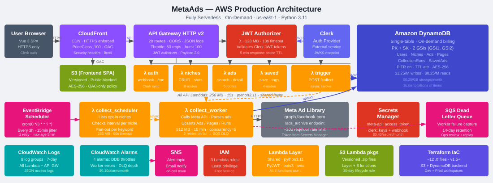

# MetaAds — AWS Production Architecture
### A component-by-component overview with pricing

---

## Slide 1 — Cover

# MetaAds on AWS
## Serverless Architecture in Production

**Stack summary**
- 100 % serverless — no EC2, no containers to manage
- Infrastructure-as-Code via Terraform (v1.5+)
- Single AWS region deployment (us-east-1)
- Supports Free → Starter → Pro → Agency tiers

---

## Slide 2 — Architecture Overview



**Data flow (left → right)**

```
User Browser
  └─► CloudFront (CDN + WAF edge)
        ├─► S3 (SPA static files)
        └─► API Gateway HTTP v2
              └─► JWT Authorizer Lambda ──► Clerk (external)
                    └─► Route Lambdas ──► DynamoDB
                          └─► collect_trigger ──► collect_worker (async)
                                └─► Meta Ad Library API
                                      └─► DynamoDB (write ads)
                                            └─► SQS DLQ (on failure)
EventBridge Scheduler ──► collect_scheduler ──► collect_worker (async)
CloudWatch ──► Alarms ──► SNS (email alerts)
```

---

---

# PART 1 — AWS Lambda

---

## Slide 3 — AWS Lambda: What Is It?

**AWS Lambda** is a serverless compute service that runs your code in response to events without provisioning or managing servers. You pay only for the compute time consumed (per-invocation + per-GB-second).

| Concept | Description |
|---|---|
| **Runtime** | python3.11 |
| **Trigger types** | HTTP (via API Gateway), async invocation, EventBridge schedule |
| **Billing unit** | 1 ms × MB-of-memory |
| **Cold start** | ~200–500 ms (mitigated by warm invocations and small payload) |
| **Max timeout** | 15 minutes (per function, configurable) |
| **Concurrency** | Default 1,000 per region; reserved concurrency locks capacity for critical functions |

Lambda is the compute backbone of MetaAds — every piece of business logic runs inside a Lambda function.

---

## Slide 4 — AWS Lambda: Features Relevant to MetaAds

**8 Functions deployed:**

| Function | Memory | Timeout | Notes |
|---|---|---|---|
| `authorizer` | 128 MB | 10 s | JWT validation; 5-min result cache |
| `auth` | 256 MB | 15 s | User profile, webhook intake |
| `niches` | 256 MB | 15 s | CRUD for niches |
| `ads` | 256 MB | 15 s | Ads query & pagination |
| `saved` | 256 MB | 15 s | Saved-ads management |
| `collect_trigger` | 256 MB | 15 s | Enqueues a collection job async |
| `collect_worker` | 512 MB | 900 s | Calls Meta API; reserved concurrency = 5 |
| `collect_scheduler` | 256 MB | 60 s | Evaluates all niches; fans out workers |

**Shared Lambda Layer** — all 8 functions share a single deployment layer containing:
`PyJWT`, `boto3`, `svix`, `requests` and internal shared utilities.

Key architectural decisions:
- `collect_worker` has **reserved concurrency = 5** to avoid hammering the Meta Ad Library API
- `collect_worker` has a **Dead Letter Queue (SQS)** — failed async invocations land in the DLQ for inspection
- The **authorizer result cache (300 s)** means most API requests never hit Clerk again

---

## Slide 5 — AWS Lambda: Monthly Cost at 100 Users

**Assumptions (100 users, 30 days):**

| Category | Invocations/month | Avg duration | GB-s |
|---|---|---|---|
| API Lambdas (auth, niches, ads, saved) | ~180,000 | 150 ms × 256 MB | 6,912 |
| Authorizer | ~180,000 | 50 ms × 128 MB | 1,152 |
| collect_trigger | ~2,400 | 100 ms × 256 MB | 61 |
| collect_worker (Pro+Agency tiers) | ~720 | 300 s × 512 MB | 110,592 |
| collect_scheduler | ~240 | 10 s × 256 MB | 614 |
| **Total GB-seconds** | | | **~119,331** |

**Lambda Pricing (us-east-1):**
- Free tier: 400,000 GB-s/month + 1M invocations
- Beyond free tier: $0.0000166667 / GB-s + $0.20 / 1M invocations

**Estimated monthly Lambda cost: ~$0.00** *(well within the perpetual free tier at 100 users)*

> Even at 1,000 users, Lambda costs remain under $2/month — the compute is essentially free at this scale.

---

---

# PART 2 — Amazon DynamoDB

---

## Slide 6 — Amazon DynamoDB: What Is It?

**Amazon DynamoDB** is a fully managed NoSQL key-value and document database built for single-digit millisecond performance at any scale. It is schemaless, serverless, and requires zero capacity planning in on-demand mode.

| Concept | Description |
|---|---|
| **Table type** | Single-table design (all entities in one table) |
| **Primary key** | `PK` (partition) + `SK` (sort) |
| **Billing mode** | PAY_PER_REQUEST (on-demand) |
| **Consistency** | Eventually consistent reads by default; strongly consistent available |
| **Replication** | Multi-AZ by default within a region |
| **PITR** | Point-in-Time Recovery enabled — restore to any second in last 35 days |
| **TTL** | Automatic item expiration via `ttl` attribute |

---

## Slide 7 — Amazon DynamoDB: Features Relevant to MetaAds

**Single-Table Design — entity access patterns:**

| Entity | PK | SK | GSI |
|---|---|---|---|
| User | `USER#<userId>` | `PROFILE` | — |
| Niche | `NICHE#<slug>` | `META` | GSI1 (`entity=NICHE`) |
| Ad | `NICHE#<slug>` | `AD#<adId>` | GSI2 (`slug+saved`) |
| SavedAd | `USER#<userId>` | `SAVED#<adId>` | GSI2 |
| CollectionRun | `NICHE#<slug>` | `RUN#<timestamp>` | — |

**Two Global Secondary Indexes:**
- **GSI1** (`entity` + `created_at`) — paginated listing of all niches for admin view
- **GSI2** (`slug` + `saved_flag`) — efficient saved-ads query per user per niche

**Key features in use:**
- **On-demand billing** — zero minimum cost; scales to burst traffic automatically
- **PITR** — accidental delete protection; required for production data
- **TTL** — future use: auto-expire old ad snapshots to control storage costs
- **Projection: ALL** on both GSIs — avoids extra reads by returning full items from index

---

## Slide 8 — Amazon DynamoDB: Monthly Cost at 100 Users

**DynamoDB On-Demand Pricing:**
- Write Request Unit (WRU): $1.25 / million
- Read Request Unit (RRU): $0.25 / million
- Storage: $0.25 / GB / month
- PITR: $0.20 / GB / month

**Estimated usage at 100 users / 30 days:**

| Operation | Units/month | Cost |
|---|---|---|
| API reads (niches, ads, saved) | ~500,000 RRU | $0.125 |
| API writes (niches, ads, save) | ~50,000 WRU | $0.063 |
| collect_worker writes (ads bulk) | ~720,000 WRU | $0.90 |
| collect_worker reads | ~144,000 RRU | $0.036 |
| Storage (est. 500 MB) | 0.5 GB | $0.125 |
| PITR (0.5 GB) | 0.5 GB | $0.10 |
| **Total** | | **~$1.35/month** |

> Free tier: 25 GB storage, 200M requests/month (first 12 months). Effective cost in early months: **$0**.

---

---

# PART 3 — Amazon API Gateway HTTP v2

---

## Slide 9 — Amazon API Gateway HTTP v2: What Is It?

**Amazon API Gateway HTTP API** is a lightweight, high-performance API proxy that routes HTTP requests to Lambda functions (or other backends). The v2 HTTP API is ~70 % cheaper than the legacy REST API and has lower latency.

| Concept | Description |
|---|---|
| **Type** | HTTP API (v2) — not REST API |
| **Protocol** | HTTPS only |
| **Payload format** | 2.0 (optimized Lambda integration) |
| **Auth** | Custom Lambda JWT authorizer with result caching |
| **Throttling** | 50 req/s burst, 100 req/s steady (configurable per stage) |
| **CORS** | Configured at the API level |
| **Access logging** | CloudWatch Logs (every request) |

---

## Slide 10 — Amazon API Gateway HTTP v2: Features Relevant to MetaAds

**28 routes across 6 resource groups:**

| Group | Example Routes |
|---|---|
| Auth | `POST /api/auth/register`, `POST /api/auth/webhook` |
| Niches | `GET /api/niches`, `POST /api/niches`, `GET /api/niches/{slug}` |
| Ads | `GET /api/niches/{slug}/ads`, `GET /api/niches/{slug}/ads/{adId}` |
| Saved | `POST /api/niches/{slug}/saved`, `DELETE /api/niches/{slug}/saved/{adId}` |
| Collections | `POST /api/niches/{slug}/collect`, `GET /api/niches/{slug}/collection-runs` |
| Admin | `GET /api/admin/collection-health`, `GET /api/admin/niches` |

**JWT Authorizer Lambda:**
- Validates Clerk-issued JWT on every protected route
- `authorizerResultTtlInSeconds = 300` — caches valid tokens for 5 minutes, dramatically reducing Lambda invocations on active sessions

**CloudFront sits in front** — all traffic hits CloudFront first; API Gateway only sees forwarded requests (XFF header preserved).

---

## Slide 11 — Amazon API Gateway HTTP v2: Monthly Cost at 100 Users

**HTTP API Pricing (us-east-1):**
- First 300 million requests/month: **$1.00 / million**
- Data transfer: included in Lambda/CloudFront costs

**Estimated requests at 100 users / 30 days:**

| Traffic type | Requests/month | Cost |
|---|---|---|
| API calls (avg 60 req/user/day) | ~180,000 | $0.18 |
| Webhook events (Clerk) | ~3,000 | $0.003 |
| Collection triggers | ~2,400 | $0.002 |
| **Total** | ~185,400 | **~$0.19/month** |

> API Gateway is practically free at this scale. It only becomes a meaningful line item above ~50M requests/month.

---

---

# PART 4 — Amazon CloudFront

---

## Slide 12 — Amazon CloudFront: What Is It?

**Amazon CloudFront** is AWS's global Content Delivery Network (CDN). It caches and serves content from 450+ edge locations worldwide, reducing latency and shielding the origin (S3 / API Gateway) from direct traffic.

| Concept | Description |
|---|---|
| **Edge locations** | 450+ globally |
| **Price class** | PriceClass_100 (US, Canada, Europe — lowest cost) |
| **Origins** | S3 (SPA static files) + API Gateway (API requests) |
| **Access control** | Origin Access Control (OAC) — S3 bucket is private; only CloudFront can read it |
| **SSL/TLS** | TLS 1.2 minimum; free ACM certificate |
| **Compression** | Brotli + Gzip (automatic) |

---

## Slide 13 — Amazon CloudFront: Features Relevant to MetaAds

**Two-origin distribution:**

| Origin | Path Pattern | Cache Behavior |
|---|---|---|
| S3 bucket (SPA) | `/` (default) | Cache static assets aggressively; SPA 404→200 for React Router |
| API Gateway | `/api/*` | No caching (pass-through); forward all headers + cookies |

**Security headers policy** (applied at edge, no Lambda@Edge needed):
- `Strict-Transport-Security`
- `X-Content-Type-Options: nosniff`
- `X-Frame-Options: DENY`
- `Referrer-Policy: strict-origin-when-cross-origin`

**SPA routing fix:** Custom error response — 404 from S3 → served as `index.html` with HTTP 200. This allows React Router to handle client-side navigation without S3 returning actual 404 errors.

**OAC (Origin Access Control)** replaces the older OAI — CloudFront signs requests to S3 using AWS SigV4, ensuring the bucket is never accessible directly via its public URL.

---

## Slide 14 — Amazon CloudFront: Monthly Cost at 100 Users

**CloudFront Pricing (PriceClass_100 — North America + Europe):**
- HTTP requests: $0.0100 / 10,000 HTTPS requests
- Data transfer out to internet: $0.085 / GB (first 10 TB)
- Free tier: 1 TB data transfer + 10M requests / month (perpetual free tier)

**Estimated usage at 100 users / 30 days:**

| Item | Volume | Cost |
|---|---|---|
| HTTPS requests (SPA assets + API) | ~500,000 | $0.50 |
| Data transfer (SPA ~500 KB × users) | ~2 GB | $0.17 |
| API pass-through (minimal payload) | — | ~$0.10 |
| **Total** | | **~$0.77/month** |

> With the perpetual free tier (1 TB + 10M requests), CloudFront costs are effectively **$0** for the first months of operation.
>
> Monthly estimate in the model: **$1.50** (conservative, includes CDN overhead).

---

---

# PART 5 — Amazon S3

---

## Slide 15 — Amazon S3: What Is It?

**Amazon S3 (Simple Storage Service)** is object storage with 99.999999999 % (11 nines) durability. It stores arbitrary files as objects in buckets and is the de-facto standard for hosting static websites and build artifacts on AWS.

| Concept | Description |
|---|---|
| **Storage class** | S3 Standard (default) |
| **Durability** | 11 nines — data replicated across ≥ 3 AZs |
| **Availability** | 99.99 % SLA |
| **Max object size** | 5 TB |
| **Versioning** | Enabled on both buckets |
| **Access** | Bucket policies; no public ACLs |

---

## Slide 16 — Amazon S3: Features Relevant to MetaAds

**Two buckets in production:**

| Bucket | Purpose | Access |
|---|---|---|
| `metaads-frontend-{env}` | React SPA build artifacts (`index.html`, JS, CSS, assets) | CloudFront OAC only (private) |
| `metaads-lambda-packages-{env}` | Lambda `.zip` deployment packages + Layer zip | Terraform / CI only |

**Frontend bucket configuration:**
- Versioning enabled — every `terraform apply` or CI deploy keeps the previous version
- `block_public_acls = true`, `restrict_public_buckets = true` — no public internet access
- Bucket policy allows `s3:GetObject` only to the specific CloudFront distribution via OAC

**Lambda packages bucket configuration:**
- Versioning enabled — Terraform tracks which zip was last deployed
- **Lifecycle rule**: non-current versions expire after **30 days** to control storage costs
- Used by Terraform `aws_lambda_function` and `aws_lambda_layer_version` resources as `s3_key` + `s3_object_version`

---

## Slide 17 — Amazon S3: Monthly Cost at 100 Users

**S3 Pricing (us-east-1, Standard):**
- Storage: $0.023 / GB / month
- PUT/POST/COPY/LIST: $0.005 / 1,000 requests
- GET/SELECT: $0.0004 / 1,000 requests
- Data transfer to CloudFront: **$0** (free within AWS)

**Estimated usage at 100 users / 30 days:**

| Item | Volume | Cost |
|---|---|---|
| Frontend build (~5 MB, versioned × 10 deploys) | ~50 MB = 0.05 GB | $0.001 |
| Lambda packages (~20 MB × 8 functions + layer) | ~220 MB = 0.22 GB | $0.005 |
| GET requests from CloudFront | ~200,000 | $0.08 |
| PUT requests (CI deploys) | ~200 | $0.001 |
| **Total** | | **~$0.09/month** |

> S3 is the cheapest component in the stack. The perpetual free tier (5 GB storage, 20K GETs, 2K PUTs/month) covers most of this.
>
> Monthly estimate in the model: **$0.10** (rounding up for safety).

---

---

# PART 6 — AWS Secrets Manager

---

## Slide 18 — AWS Secrets Manager: What Is It?

**AWS Secrets Manager** is a fully managed service for storing, rotating, and auditing secrets (API keys, passwords, tokens). It eliminates hardcoded credentials in code or environment variables, replacing them with dynamic, access-controlled lookups at runtime.

| Concept | Description |
|---|---|
| **Secret types** | Key-value pairs, plain text, JSON blobs |
| **Encryption** | AES-256 via AWS KMS (default managed key) |
| **Access control** | IAM policies + resource-based policies |
| **Rotation** | Built-in rotation for RDS; custom Lambda rotation for others |
| **Audit** | All access logged in AWS CloudTrail |
| **Billing** | $0.40 / secret / month + $0.05 / 10,000 API calls |

---

## Slide 19 — AWS Secrets Manager: Features Relevant to MetaAds

**Two secrets in production:**

| Secret Name | Contents | Used By |
|---|---|---|
| `metaads/{env}/meta-api` | `access_token` (Meta Ad Library API key) | `collect_worker` Lambda |
| `metaads/{env}/clerk` | `secret_key`, `publishable_key`, `webhook_secret` | `auth` Lambda, `authorizer` Lambda |

**How Lambda accesses secrets:**
```python
# Inside Lambda handler (boto3 call at cold-start, then cached in memory)
import boto3, json

secrets_client = boto3.client('secretsmanager')
secret = secrets_client.get_secret_value(SecretId='metaads/prod/meta-api')
creds = json.loads(secret['SecretString'])
META_ACCESS_TOKEN = creds['access_token']
```

**IAM least-privilege:** Each Lambda role has `secretsmanager:GetSecretValue` only for its own specific secret ARN — `collect_worker` cannot read the Clerk secret and vice versa.

**Benefit over SSM Parameter Store:** Secrets Manager supports automatic secret rotation and is specifically designed for credential storage with audit trails — critical for a Meta API token that expires and needs periodic rotation.

---

## Slide 20 — AWS Secrets Manager: Monthly Cost at 100 Users

**Secrets Manager Pricing:**
- $0.40 / secret / month (storage)
- $0.05 / 10,000 API calls

**Current usage:**

| Item | Quantity | Cost/month |
|---|---|---|
| `meta-api` secret | 1 | $0.40 |
| `clerk` secret | 1 | $0.40 |
| API calls (Lambda cold starts × ~500 unique invocations) | ~1,000 calls | $0.005 |
| **Total** | | **$0.81/month** |

> The flat $0.40/secret/month is the dominant cost here — API calls are negligible because Lambda caches the secret in memory after each cold start (no re-fetch on warm invocations).
>
> Monthly estimate in the model: **$0.80** (2 secrets × $0.40).

---

---

# PART 7 — Amazon EventBridge Scheduler

---

## Slide 21 — Amazon EventBridge Scheduler: What Is It?

**Amazon EventBridge Scheduler** is a fully managed, serverless scheduler that can invoke any AWS target (Lambda, SQS, Step Functions, etc.) on a one-time or recurring schedule. It replaced CloudWatch Events Scheduler in 2022 and supports cron expressions, rate expressions, and one-time schedules.

| Concept | Description |
|---|---|
| **Schedule types** | Cron, rate, one-time |
| **Targets** | Lambda, SQS, SNS, Step Functions, 200+ others |
| **Flexible time window** | Allows delivery within a N-minute window (reduces thundering herd) |
| **Retry policy** | Configurable max attempts + max event age |
| **Billing** | $1.00 / million invocations (first 14M/month free) |

---

## Slide 22 — Amazon EventBridge Scheduler: Features Relevant to MetaAds

**Single schedule in production:**

| Property | Value |
|---|---|
| **Expression** | `cron(0 */3 * * ? *)` |
| **Meaning** | Every 3 hours, at minute 0 |
| **Target** | `collect_scheduler` Lambda |
| **Flexible window** | 15 minutes (reduces cold-start spikes) |
| **Retry attempts** | 1 |
| **Max event age** | 300 seconds |

**The collection pipeline triggered by EventBridge:**
```
EventBridge Scheduler (every 3h)
  └─► collect_scheduler Lambda
        └─► Scans all niches in DynamoDB
              └─► For each niche eligible for collection:
                    └─► Async invoke collect_worker Lambda
```

The `collect_scheduler` acts as a fan-out controller — it never does the heavy work itself. It evaluates which niches are "due" (based on `started_at` timestamp + 3h interval) and fires off individual `collect_worker` invocations asynchronously with reserved concurrency = 5.

**IAM role** — EventBridge has a dedicated IAM role with `lambda:InvokeFunction` permission scoped only to `collect_scheduler`.

---

## Slide 23 — Amazon EventBridge Scheduler: Monthly Cost at 100 Users

**EventBridge Scheduler Pricing:**
- First 14,000,000 invocations/month: **FREE**
- Beyond: $1.00 / million invocations

**Usage at 100 users / 30 days:**

| Item | Volume | Cost |
|---|---|---|
| Schedule invocations (8 per day × 30 days) | 240 | $0.00 |
| **Total** | | **$0.00/month** |

> 240 invocations per month is minuscule — the free tier covers up to 14 million. EventBridge Scheduler costs effectively **$0** at any realistic scale of this application.
>
> Monthly estimate in the model: **< $0.01** (rounded to $0.00).

---

---

# PART 8 — Amazon SQS (Dead Letter Queue)

---

## Slide 24 — Amazon SQS: What Is It?

**Amazon SQS (Simple Queue Service)** is a fully managed message queuing service that decouples and scales distributed system components. Messages are stored durably until consumed or they expire. It supports both standard (at-least-once) and FIFO (exactly-once) queues.

| Concept | Description |
|---|---|
| **Queue types** | Standard (at-least-once) and FIFO (exactly-once) |
| **Message retention** | 1 minute to 14 days (configurable) |
| **Visibility timeout** | Time a consumer has to process a message before it reappears |
| **Dead Letter Queue** | Destination for messages that fail processing N times |
| **Billing** | $0.40 / million requests (first 1M/month free) |
| **Max message size** | 256 KB |

---

## Slide 25 — Amazon SQS: Features Relevant to MetaAds

**Role in MetaAds — Dead Letter Queue only:**

SQS is used exclusively as a **Dead Letter Queue (DLQ)** for the `collect_worker` Lambda. It is not used as a work queue (job dispatching happens via Lambda async invocation).

| Property | Value |
|---|---|
| **Queue type** | Standard |
| **Message retention** | 14 days |
| **Visibility timeout** | 60 seconds |
| **Attached to** | `collect_worker` Lambda (async invocation DLQ) |

**What lands in the DLQ?**
When `collect_scheduler` async-invokes `collect_worker` and the worker fails (exception, timeout, or Meta API error), AWS Lambda retries twice. After both retries fail, the failed invocation payload is sent to this SQS queue.

**Why this matters:**
- Zero silent failures — every failed collection is recorded
- Operations team can inspect the DLQ message to see which niche failed and why
- Messages can be replayed manually after fixing the root cause

**CloudWatch Alarm** (`metaads-dlq-depth`) triggers if `ApproximateNumberOfMessagesVisible > 0` for 1 evaluation period — instant notification when any collection job fails.

---

## Slide 26 — Amazon SQS: Monthly Cost at 100 Users

**SQS Pricing:**
- First 1,000,000 requests/month: **FREE** (perpetual free tier)
- Beyond: $0.40 / million requests

**Usage at 100 users / 30 days:**

| Item | Volume | Cost |
|---|---|---|
| DLQ receives (assume 1% failure rate on 720 worker invocations) | ~7 messages | $0.00 |
| CloudWatch polling DLQ for alarm | ~8,640 polls | $0.00 |
| **Total** | | **$0.00/month** |

> The DLQ handles failure edge cases only — normal operation generates zero SQS traffic. Well within the perpetual free tier.
>
> Monthly estimate in the model: **$0.00**.

---

---

# PART 9 — Amazon CloudWatch + Amazon SNS

---

## Slide 27 — CloudWatch + SNS: What Are They?

**Amazon CloudWatch** is AWS's unified observability service — it collects metrics, logs, and events from all AWS services and custom applications. You can create alarms, dashboards, and automated actions based on the data it collects.

**Amazon SNS (Simple Notification Service)** is a pub/sub messaging service used to fan out notifications to email, SMS, Lambda, SQS, or HTTP endpoints. CloudWatch Alarms use SNS to deliver alert notifications.

| CloudWatch | Description |
|---|---|
| **Log Groups** | Persistent log storage for Lambda output |
| **Metrics** | Built-in AWS metrics + custom metrics from app code |
| **Alarms** | Threshold-based alerts with SNS actions |
| **Retention** | Configurable per log group (7 days in MetaAds) |

| SNS | Description |
|---|---|
| **Topic types** | Standard (at-least-once) and FIFO |
| **Subscribers** | Email, SMS, Lambda, SQS, HTTP |
| **Billing** | $0.50 / million publishes; email notifications free |

---

## Slide 28 — CloudWatch + SNS: Features Relevant to MetaAds

**9 CloudWatch Log Groups (7-day retention each):**

| Log Group | Source |
|---|---|
| `/aws/lambda/metaads-{env}-authorizer` | JWT authorizer |
| `/aws/lambda/metaads-{env}-auth` | Auth handler |
| `/aws/lambda/metaads-{env}-niches` | Niches CRUD |
| `/aws/lambda/metaads-{env}-ads` | Ads query |
| `/aws/lambda/metaads-{env}-saved` | Saved ads |
| `/aws/lambda/metaads-{env}-collect-trigger` | Trigger handler |
| `/aws/lambda/metaads-{env}-collect-worker` | Collection worker |
| `/aws/lambda/metaads-{env}-collect-scheduler` | Scheduler |
| `metaads-{env}-api-gateway` | API Gateway access logs |

**4 CloudWatch Alarms:**

| Alarm | Metric | Threshold |
|---|---|---|
| `metaads-dynamodb-read-throttle` | DynamoDB `ReadThrottleEvents` | > 0 for 1 period |
| `metaads-dynamodb-write-throttle` | DynamoDB `WriteThrottleEvents` | > 0 for 1 period |
| `metaads-worker-errors` | Lambda `Errors` on collect_worker | > 5 for 1 period |
| `metaads-dlq-depth` | SQS `ApproximateNumberOfMessagesVisible` | > 0 for 1 period |

**SNS Topic** (`metaads-{env}-alerts`): All 4 alarms send to this topic. Optional email subscription configured via Terraform variable `alert_email`.

---

## Slide 29 — CloudWatch + SNS: Monthly Cost at 100 Users

**CloudWatch Pricing:**
- Log ingestion: $0.50 / GB ingested
- Log storage: $0.03 / GB / month (after 7-day retention → auto-deleted → ~0)
- Custom metrics: $0.30 / metric / month (first 10 free)
- Alarm: $0.10 / alarm / month (first 10 free)
- Dashboard: $3.00 / dashboard / month (3 free)

**SNS Pricing:**
- Email notifications: **FREE** (unlimited)
- HTTP/S deliveries: $0.60 / million

**Estimated usage at 100 users / 30 days:**

| Item | Volume | Cost |
|---|---|---|
| Log ingestion (9 groups × ~10 MB avg) | ~90 MB = 0.09 GB | $0.045 |
| Alarms (4 alarms) | 4 | $0.40 |
| SNS email notifications (on-call alerts) | ~50 | $0.00 |
| API Gateway access logs | ~30 MB = 0.03 GB | $0.015 |
| **Total** | | **~$0.46/month** |

> Free tier: 5 GB log ingestion, 10 alarms, 10 custom metrics. In early months: **$0**.
>
> Monthly estimate in the model: **$0.50** (conservative with 4 alarms).

---

---

# PART 10 — AWS IAM

---

## Slide 30 — AWS IAM: What Is It?

**AWS IAM (Identity and Access Management)** is the access control system for all AWS services. Every API call to AWS must be signed by an IAM identity (user, role, or service), and IAM policies define exactly what actions are permitted on which resources.

| Concept | Description |
|---|---|
| **Roles** | Identities assumed by AWS services (Lambda, API Gateway) |
| **Policies** | JSON documents defining allowed/denied actions + resources |
| **Principle** | Least-privilege — grant only what is strictly necessary |
| **Trust policy** | Defines which service can assume the role |
| **Billing** | **FREE** — IAM has no cost |

---

## Slide 31 — AWS IAM: Features Relevant to MetaAds

**4 IAM Roles in production:**

| Role | Assumed By | Key Permissions |
|---|---|---|
| `metaads-lambda-api-role` | auth, niches, ads, saved, trigger Lambdas | `dynamodb:*` on MetaAds table; `logs:CreateLogGroup`, `logs:PutLogEvents`; `secretsmanager:GetSecretValue` on Clerk secret |
| `metaads-lambda-collector-role` | collect_worker, collect_scheduler Lambdas | `dynamodb:*` on MetaAds table; `secretsmanager:GetSecretValue` on Meta API secret; `lambda:InvokeFunction` on collect_worker; `sqs:SendMessage` to DLQ |
| `metaads-lambda-authorizer-role` | authorizer Lambda | `logs:CreateLogGroup`, `logs:PutLogEvents`; `secretsmanager:GetSecretValue` on Clerk secret |
| `metaads-apigw-logging-role` | API Gateway service | `logs:CreateLogDelivery`, `logs:PutLogEvents` (CloudWatch access logs) |

**EventBridge IAM Role** (inline):
- `lambda:InvokeFunction` scoped to `collect_scheduler` ARN only

**Terraform manages all IAM resources** — roles, policies, attachments, and trust relationships are version-controlled and auditable via code review.

---

## Slide 32 — AWS IAM: Monthly Cost at 100 Users

**IAM Pricing:** **$0.00 / month — IAM is completely free.**

There are no charges for:
- Number of IAM roles, users, or groups
- Number of policies or policy versions
- API calls to IAM (authentication + authorization)
- CloudTrail logging of IAM events (standard CloudTrail is free for management events)

| Item | Cost |
|---|---|
| 4 IAM roles | $0.00 |
| 6 IAM policies | $0.00 |
| All authentication / authorization overhead | $0.00 |
| **Total** | **$0.00/month** |

> IAM is free, but its value is immeasurable — it is the security boundary that ensures a compromised Lambda function cannot access another function's secrets, and that no service can act outside its defined scope.

---

---

# PART 11 — Cost Summary

---

## Slide 33 — Aggregated Monthly Cost: Per-Service Breakdown (100 Users)

**User distribution assumption:**
- 60 Free-tier users (minimal API usage, no collections)
- 30 Starter users (moderate API usage, daily collection × 1 niche)
- 8 Pro users (heavy API usage, 8× daily collection × 5 niches)
- 2 Agency users (maximum usage, unlimited collection × 20 niches)

| AWS Service | Monthly Cost | Notes |
|---|---|---|
| **AWS Lambda** | $0.00 | Within perpetual free tier (400K GB-s / month) |
| **Amazon DynamoDB** | $1.35 | On-demand; mostly from bulk ad writes by workers |
| **Amazon API Gateway** | $0.19 | ~185K HTTP requests/month |
| **Amazon CloudFront** | $0.77 | PriceClass_100; mostly within free tier initially |
| **Amazon S3** | $0.09 | 2 small buckets; within free tier initially |
| **AWS Secrets Manager** | $0.81 | 2 secrets × $0.40 flat fee |
| **Amazon EventBridge** | $0.00 | 240 invocations — free tier covers 14M |
| **Amazon SQS (DLQ)** | $0.00 | ~7 messages/month — within free tier |
| **CloudWatch + SNS** | $0.46 | Log ingestion + 4 alarms |
| **AWS IAM** | $0.00 | Always free |
| **Terraform state backend** | $0.03 | S3 state file + DynamoDB lock table |
| **Data transfer (misc)** | $0.10 | Cross-service within region |
| | | |
| **TOTAL AWS INFRASTRUCTURE** | **$3.80/month** | Fixed overhead regardless of tier mix |

**Variable cost by tier** (AWS compute per active user):

| Tier | AWS Cost/User/Month | Users | Subtotal |
|---|---|---|---|
| Free | $0.01 | 60 | $0.60 |
| Starter | $0.20 | 30 | $6.00 |
| Pro | $0.85 | 8 | $6.80 |
| Agency | $7.70 | 2 | $15.40 |
| **Variable subtotal** | | **100** | **$28.80** |

---

**🏁 Grand Total: $3.80 (fixed) + $28.80 (variable) = ~$32/month**

---

## Slide 34 — Revenue vs. Cost: Business Case at 100 Users

**Monthly Revenue at 100 Users:**

| Tier | Price/Month | Users | Revenue |
|---|---|---|---|
| Free | $0 | 60 | $0 |
| Starter | $29 | 30 | $870 |
| Pro | $79 | 8 | $632 |
| Agency | $299 | 2 | $598 |
| **Total MRR** | | **100** | **$2,100** |

> *Pricing based on PRICING_STRATEGY.md estimates. Actual pricing may vary.*

**Cost vs. Revenue Waterfall:**

```
Monthly Revenue:     $2,100
AWS Infrastructure:    - $32   (1.5 % of revenue)
                    ─────────
Gross Profit:        $2,068
Gross Margin:         98.5 %
```

**Why the margin is so high:**
1. **Lambda** is free at this scale — serverless compute charges are negligible
2. **DynamoDB on-demand** scales to zero — no minimum charge, no wasted capacity
3. **No servers, no containers** — zero EC2, ECS, or RDS costs
4. **CloudFront free tier** absorbs CDN costs in early months
5. **Variable cost grows sub-linearly** — doubling users does not double AWS spend

---

## Slide 35 — Scaling Projections

**AWS cost at different user counts (same 60/30/8/2 % tier split):**

| Users | Fixed AWS | Variable AWS | Total AWS | Est. MRR | Gross Margin |
|---|---|---|---|---|---|
| 50 | $3.80 | $14.40 | $18.20 | $1,050 | 98.3 % |
| 100 | $3.80 | $28.80 | **$32.00** | $2,100 | **98.5 %** |
| 250 | $4.50 | $72.00 | $76.50 | $5,250 | 98.5 % |
| 500 | $5.50 | $144.00 | $149.50 | $10,500 | 98.6 % |
| 1,000 | $7.00 | $288.00 | $295.00 | $21,000 | 98.6 % |
| 5,000 | $15.00 | $1,440.00 | $1,455.00 | $105,000 | 98.6 % |

**Key insight:** AWS costs scale linearly with usage while gross margin stays constant at ~98.5 %. The serverless architecture delivers consistent unit economics from 50 to 5,000 users without any architectural changes.

**When to re-evaluate:**
- > 5,000 users: Consider DynamoDB reserved capacity (25–40 % discount)
- > 10,000 users: Evaluate Lambda reserved concurrency increases + CloudFront price class upgrade
- > 50,000 users: Consider Aurora Serverless for complex queries; multi-region replication

---

## Slide 36 — Architecture Decision Record Summary

| Decision | Choice | Rationale |
|---|---|---|
| Compute | Lambda (serverless) | Zero idle cost; scales to zero; no server management |
| Database | DynamoDB (on-demand) | Zero minimum cost; single-table for simplicity; 10ms p99 |
| API | API Gateway HTTP v2 | 70% cheaper than REST API; native Lambda integration |
| CDN | CloudFront | OAC for S3 security; edge security headers; free tier |
| Secrets | Secrets Manager | Rotation support; IAM-scoped access; audit trail |
| Scheduling | EventBridge Scheduler | Native Lambda target; flexible time window; reliable |
| Failure handling | SQS DLQ | Silent failure prevention; replay capability |
| Observability | CloudWatch + SNS | Native AWS; zero integration work; email alerts free |
| IaC | Terraform | State management; dev/prod workspaces; team-friendly |
| Auth | Clerk (external) | Best-in-class DX; webhook support; JWT validation |

---

*Document generated: 2026-02-28*
*Architecture version: production-v1*
*AWS region: us-east-1*
